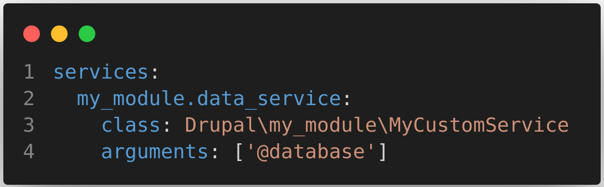
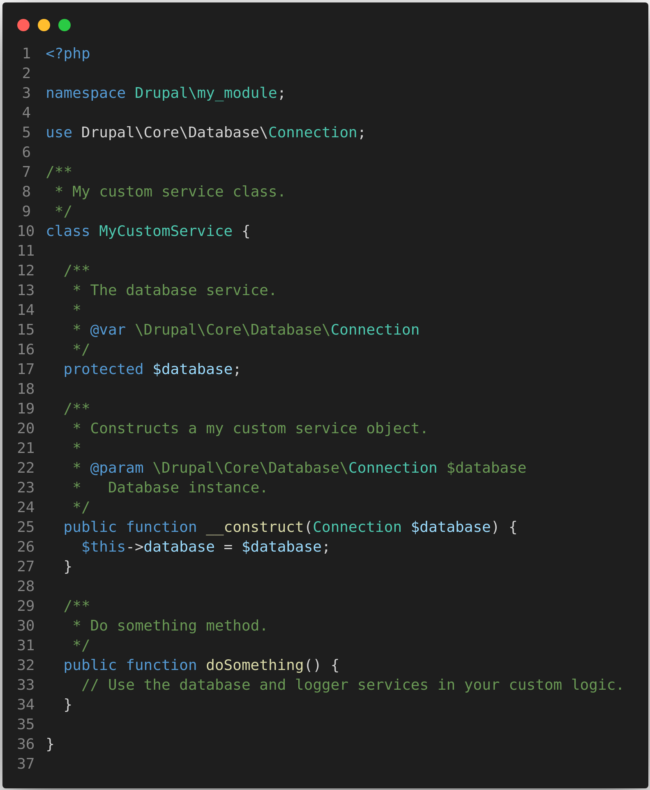
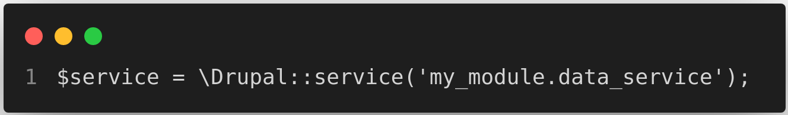
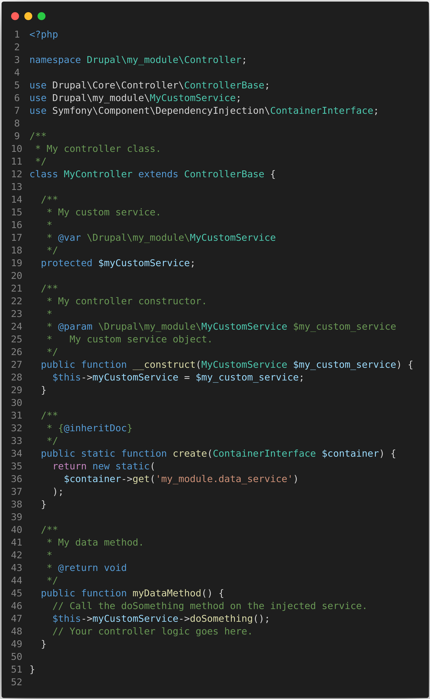

# Services and Dependency Injection #
#### What is Services? ####
A service is an object that gets instantiated by a Service Container and is used to handle operations in
a reusable way, for example, performing calculations and interacting with the database, an external
API, or any number of things. Moreover, it can take dependencies (other services) and use them to
help out. Services are a core part of the dependency injection (DI) principle that is commonly used
in modern PHP applications and in Drupal.

> Many Drupal 8 core service definitions can be found inside the core.services.yml file located in the root /core folder.
So, if you are ever looking for service names to use, your best bet is to look there. Additionally, core modules also
have service definitions inside their respective *.services.yml files. So, make sure that you also check there.

Key points to remember:
- Services in Drupal refer to the various functionalities that are provided by the drupal core, contributed modules, or custom modules.
- Services can take many forms, such as authentication, content management, search, media, e-commerce, social media integration, and analytics.
- Drupal allows developers to create custom services, which can be accessed by other modules or external applications using APIs.
- Services play a critical role in extending the functionality of a website and can be used to build complex, powerful applications.

#### Why use Services? ####
why services are used in Drupal:

- Services are used to extend the core functionality of Drupal and add new features to a website.
- They make it easy to connect Drupal with other applications and systems by exposing functionality via web services and APIs.
- Services can decouple Drupal from the front-end presentation layer, which provides greater flexibility and scalability.
- They can be reused across multiple sites and applications, providing a more efficient development process.
- Services can be used to automate common tasks, such as content creation, user management, and data import/export.
- They provide a way to integrate Drupal with other systems, such as CRM tools, e-commerce platforms, and marketing automation tools.
- Services are an essential component of Drupal, providing a way to extend the platform's functionality and integrate it with other systems and applications.

#### What is Dependency Injection? ####
As defined by Wikipedia, "dependency injection is a technique whereby one object supplies the dependencies of another object. A dependency is an object that can be used (a service). An injection is the passing of a dependency to a dependent object (a client) that would use it. The service is made part of the client’s state."

It simply means passing the service (i.e. dependency) to the client (i.e. dependent). This passing of the service to the client rather than allowing the client to build/find the service is known as dependency injection.

#### Why use Dependency Injection? ####
- It helps developers build modular, flexible, testable, decoupled functionality, code more reusable, and maintainable code.
- It separates concerns and dependencies in code.
- It allows code to be divided into smaller, more manageable pieces.
- It promotes encapsulation by ensuring each object is responsible for its own functionality.
- It allows for easier testing of individual components.
- In web development, it is particularly useful for building complex applications.
- These complex applications rely on many interdependent objects and services.

#### How to use Services & DI? ####
**Find services in Drupal's API documentation**

There's a comprehensive list of all the services in Drupal core available on api.drupal.org [here](https://api.drupal.org/api/drupal/services). Use the filter at the top of the page to find what you're looking for. The first column in the table contains the unique machine name of the service which you can use to request it from the service container.

#### Using Services in Drupal ####
There are essentially two ways **statically** and **injected**. The first is done by a static call to the
Service Container, whereas the second uses dependency injection to pass the object through the
constructor (or in some rare cases, a setter method). However, let's check out how, why, and what is
the real difference.
Statically, you would use the global **Drupal** class to instantiate a service:
> $service = \Drupal::service('hello_world.my_service');

This is how we use services in the **.module** files and classes which are not exposed to the Service
Container and into which we cannot inject. Instances of the latter are rare though, most of the time we
use the static calls only from within static contexts.
A few popular services also have shorthand methods on the **\Drupal** class: for example,
**\Drupal::entityTypeManager()**. I recommend that you inspect the **\Drupal** class and take a look at the ones
with shorthand methods available.

**Note:** The proper way to use services is to inject them where needed like inside a Controller, service, plugin or any other class where dependency injection is an option.

#### How to create custom drupal services? ####
- Define the service: First, you need to define your custom service in a custom module. You can define it in your module's .services.yml file or in a separate file. For example:
  
This code defines a service with the ID **my_module.data_service**, using the class MyCustomService in the **Drupal\my_module** namespace. The service has one dependencies injected, the database service.

- Create the service class: Next, you need to create the class for your custom service. For example:
  
  
#### How to inject custom services in drupal? ####
- Statically Example:
  
  
- Injected Example:
  
  
**Note**: Except **.module** file everywhere use **injected way** only because this way is **more secure, faster & testable**.
  
[Code Snippet](code-snippet.md)

References:
- [Drupal official doc](https://www.drupal.org/docs/drupal-apis/services-and-dependency-injection/services-and-dependency-injection-in-drupal-8)

:house: [Home Page](README.md) | [<< Previous Page](controller.md) | [Next Page >>](rest-api.md)
